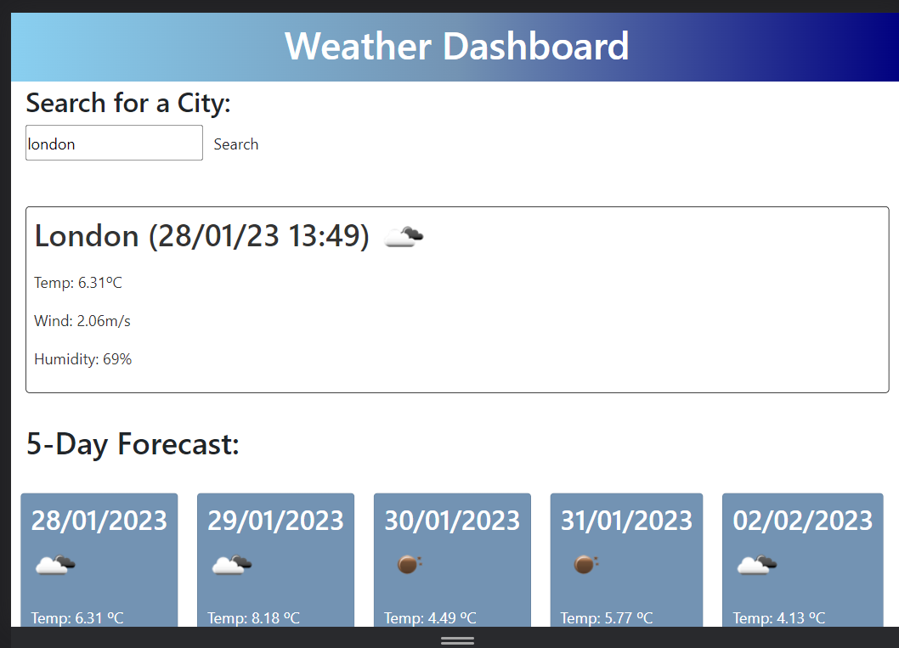

# Weather-Dashboard

## Description

This is a simple weather application, users are able to enter any location into the search input field and they will be able to see the current weather as well as a 5 - day forcast. The app utilises data from the [openweather API](https://openweathermap.org).

Screenshot of the app

## Installation

N/A

## Usage

Check out the deployed application on https://iosazee.github.io/weather-dashboard/

## Credits

My teachers and mentors at Trilogy/EDx bootcamp.